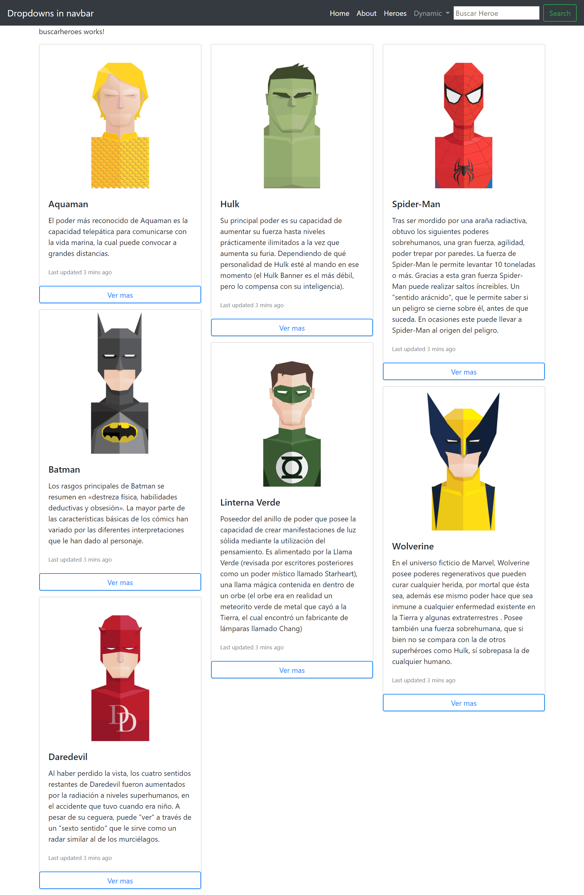
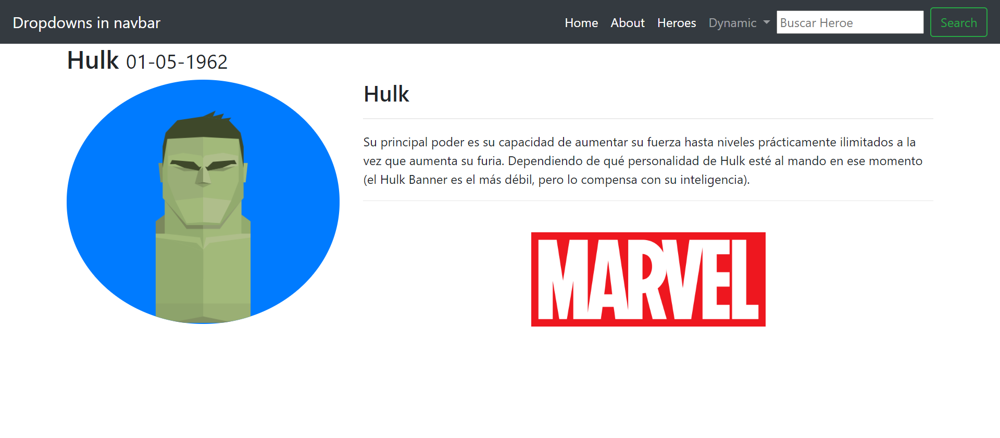

# Spa

This project was generated with [Angular CLI](https://github.com/angular/angular-cli) version 10.0.0.
## Nota
 No hay necesidad de crear otro componente donde copiemos el mismo código, se puede usar el código de la clase heroes y agregarle una ruta con un parametro, ese parametro va a ser lo que buscamos dentro de la navbar. En el constructor de heroes ahora debemos hacer esto :
 
             constructor(private heroesService: HeroesService,
              private actRoute : ActivatedRoute,
              private router : Router) {

                //console.log("Estoy en el constructor");

               this.actRoute.params.subscribe(params =>{
                  this.list = params['heroe'];
                  if(this.list == null)

                    this.heroes= this.heroesService.getHeroes();

                  else

                    this.heroes = this.heroesService.searchHeroes(this.list);

                });

                console.log(this.list);

               }
## Development server

Run `ng serve` for a dev server. Navigate to `http://localhost:4200/`. The app will automatically reload if you change any of the source files.

## Code scaffolding

Run `ng generate component component-name` to generate a new component. You can also use `ng generate directive|pipe|service|class|guard|interface|enum|module`.

## Build

Run `ng build` to build the project. The build artifacts will be stored in the `dist/` directory. Use the `--prod` flag for a production build.

## Running unit tests

Run `ng test` to execute the unit tests via [Karma](https://karma-runner.github.io).

## Running end-to-end tests

Run `ng e2e` to execute the end-to-end tests via [Protractor](http://www.protractortest.org/).

## Further help

To get more help on the Angular CLI use `ng help` or go check out the [Angular CLI README](https://github.com/angular/angular-cli/blob/master/README.md).
